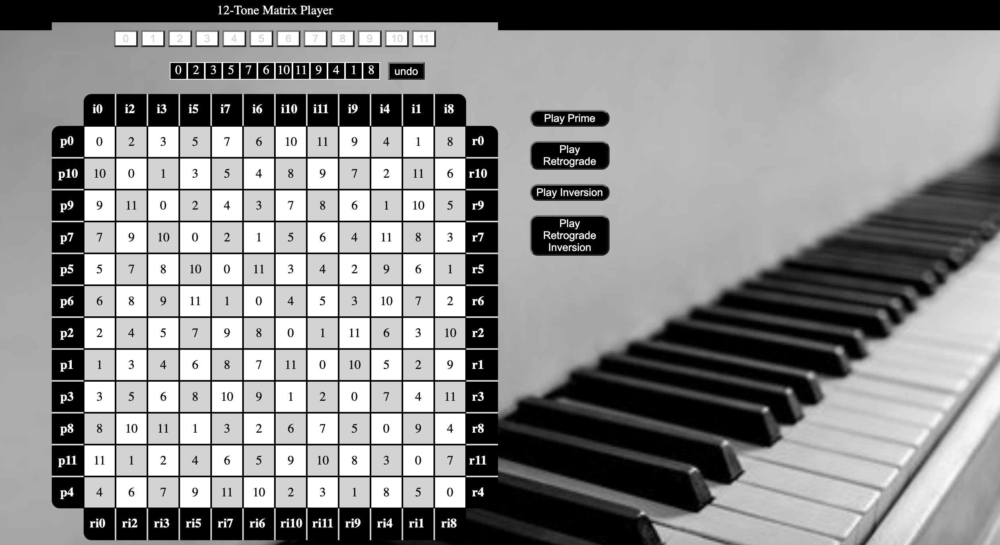

# **Why?**

I guess we should start with what "12-tone" music is. 12-tone composition, sometimes referred to as "dodecophony", is a compositional method whereby no one musical pitch is treated with any more importance than another.

To contextualize, most music we are familar with in the western musical tradition is "tonal". Most songs you've ever heard are in the "key of" something. If a song is in the key of C, for example, the note "C" is the tonal center of the song. The most important note. All harmonies and progressions are relative to C. The goal of a tonal tune is generally to start at its tonal center, wander away from it, and then return to it. That's western music in a nutshell.

12-tone music doesn't place any such importance on any one note. In a 12-tone tune, if you play C, you must play all of the other existing notes before you can play C again. (If you're not aware, there are really only 12 notes in the western musical tradition. If you start at C on a piano and proceed to play every note to the right of it, one-by-one, the 13th note you play will be C again. The note names start over.)

So the big question in 12-tone music is what order do the pitches appear in? Sure, you could technically just change their order each time you've played all 12 of them. But that would be tedious. Instead, many 12-tone composers use a matrix. Once you've determined the order you want your pitches to appear in (that order is called the "prime row"), a 12-tone matrix will show you what that row looks like backwards (retrograde), upside-down (inverted), and backwards and upside-down (retrograde inversion). It will also show you all of those versions should you decide to transpose your row to a different starting point. Suffice it to say, a 12-tone matrix is simply a way of showing you all the ways to shake things up without having to decide on a new row with each 12-note repetition. 

Long story short: 12-tone music is an overly-complicated style of music that maybe a handful of people in the world actually enjoy. But I am one of those people. 

I also compose 12-tone music at a prolific rate. So 12-tone matrices are a tool I rely on quite heavily. While there are a few web-based 12-tone matrix calculators that I am aware of, they all lack an important feature: none of them let you hear the row you've decided on. So I made one that does.

Hence:

# **12-Tone Matrix Player**

[Try it out!](https://blake-d.github.io/12-tone-matrix-player/)

**12-Tone Matrix Player** presents the user with 12 buttons, one for each note. The user clicks on the buttons in the order in which they want them to appear in the prime row, and the application cranks out all possible transpositions of the prime, retrograde, inverted, and retrograde-inverted rows.

Once the matrix has been filled out, the user can select one of four playback buttons that will produce audio renderings of the prime, retrograde, inverted, and retrograde-inverted rows, respectively.

## **MVP**
- create a function that takes the prime row and calculates all 144 variations of it.

- create a function that plays an audio rendering of the base version of each row type. 

## **Stretch Goals**

- create a function that plays any transposition of any of the four row types.

## **Tech Stack**

- Javascript
- HTML
- CSS

## **Unresolved Issues**

Aside from some design hiccups, the only real problem I have with it in its current form is the shabby playback. The playback function just cues up mp3 files I've uploaded to the app, and cueing mp3's is always kind of imprecise on the web. Therefore playback is just kind of jumpy. The playback function is programmed to simply cue all 12 notes a half-second apart from one another, but it's kind of inconsistent. Sometimes notes will play late or closer together, and in doing so, it almost creates unintentional rythms. It still conveys the general idea, which is all that's really important. But hosting the audio files elsewhere would probably be a better idea.
